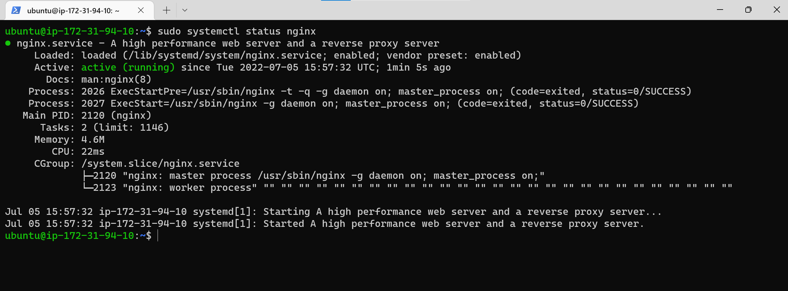
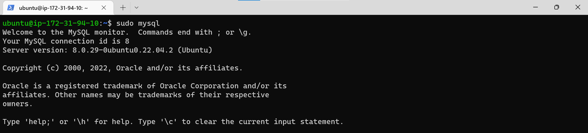
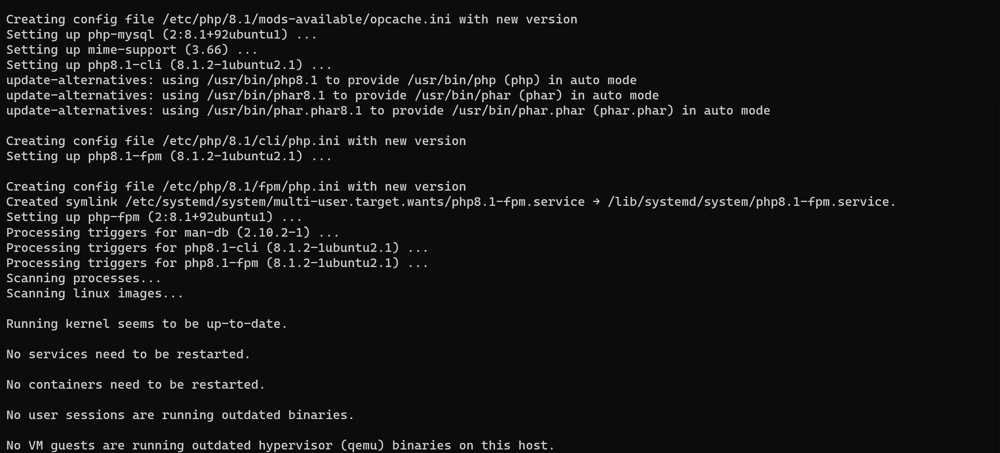
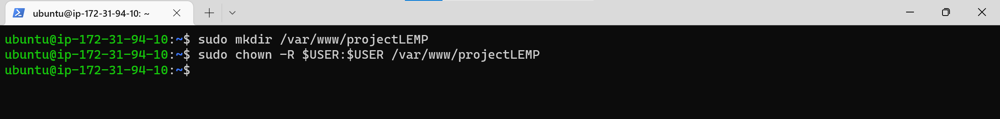
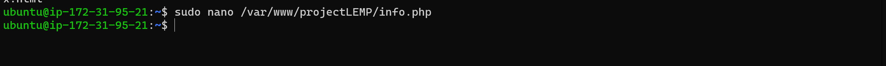
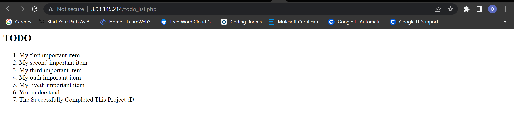

**STEP ONE**

Login into your AWS account, Lunch Ec2 instance with your prefered settings. Click [here](https://github.com/oayanda/WEB-STACK-IMPLEMENTATION-LAMP-STACK-IN-AWS/blob/main/Project1.md) for more details.

1. SSH into the Linux terminal AWS EC2 to update the packages and install nginx webserver.

`sudo apt update`

`sudo apt install nginx`

2. Verify ngnix is successfully running.

`sudo systemctl status nginx`

3. To access the nginx web server locally and in the browser - make sure the default (port 80) is opened in your security group settings.

- Locally
`curl http://localhost`

- In the browser (use the public Ip address of the vm)
`curl http://44.203.157.197/`

**STEP TWO**

Installation of the database - MySql.

1. Install MySql

`sudo apt install mysql-server`

2. Login into MySql

`sudo mysql`

3. Currently, we are login as the Admin (sudo mysql). Set a new password for the Admin/root by using mysql_native_password as default authentication method and the exit.

`ALTER USER 'root'@'localhost' IDENTIFIED WITH mysql_native_password BY 'PassWord.1';`

4.  For security reasons, we need to remove all insecure default settings (e.g, password strength, test database e.t.c) by a pre-installed script.

`sudo mysql_secure_installation;`

5. Test MySql Admin/root login and exit.

`sudo mysql -p`

**STEP THREE**

PHP installation

1. We would need to install wo packages.
- a php processing process that at as a bridge between php interpreter and Nginx web server - php fastCGI

- Php-MySQL - php module that allows communication between php and mysql database.

`sudo apt install php-fpm php-mysql`

**STEP FOUR**

Configuring Nginx to use the Php processor.

1. Create a web directory to host our application which is different from the default at /var/www/html. Additional, assign ownership of the current system user to the newly create directory.

`sudo mkdir /var/www/projectLEMP`

`sudo chown -R $USER:$USER /var/www/projectLEMP`

2. Create a new configuration file for projectLEMP directory.

`sudo nano /etc/nginx/sites-available/projectLEMP`

3. Activate your configuration by linking to the config file from Nginx’s sites-enabled directory and test for error in the configuration file.

`sudo ln -s /etc/nginx/sites-available/projectLEMP /etc/nginx/sites-enabled/`

4. Test configuration for error

`sudo nginx -t`

4. Disable the default ngix host/directory *defualt* which listen on port 80 and reload ngnix.

`sudo unlink /etc/nginx/sites-enabled/default`

`sudo systemctl reload nginx`

5. Create an index.html to test the custom directory *proectLEMP*.

`sudo echo 'Hello LEMP from hostname' $(curl -s http://169.254.169.254/latest/meta-data/public-hostname) 'with public IP' $(curl -s http://169.254.169.254/latest/meta-data/public-ipv4) > /var/www/projectLEMP/index.html`

- View in browser (using public ip address).

- View in browser (using dns address).

**STEP FIVE**

Test to make sure Nginx can handle *.php* files.

1. Create a info.php.

`sudo nano /var/www/projectLEMp/info.php`

2. Test in the browser with the vm dns or ip.

3. For security reasons, delete the info.php file. It can also be generated we needed.

`sudo rm /var/www/projectLEMp/info.php`

**STEP SIX**

Retrieving data from MySQL using Php.

1. Login into mysql (Admin/root account)
`sudo mysql -p`

2. Create a database

`create database project2db `

3. Create user and password.

`CREATE USER 'project2_user'@'%' IDENTIFIED WITH mysql_native_password BY 'PassWord.2';`

- Grant full privileges and exit.

4. Login with the new user credentials.

`mysql -u example_user -p`

5. View the databases in the MySQL database sever.

`show databases;`

6. Create a table

`CREATE TABLE project2db.todo_list ( item_id INT AUTO_INCREMENT, content VARCHAR(255), PRIMARY KEY(item_id));`

7. Insert some records into the table.

`CREATE TABLE project2db.todo_list ( item_id INT AUTO_INCREMENT, content VARCHAR(255), PRIMARY KEY(item_id));`

8. Confirm the data is saved into the table and exit.

`SELECT * FROM project2db.todo_list;`

8. Create a php page to fetch the data from the database.

`nano /var/www/projectLEMP/todo_list.php`

save and close.

9. View todo_list.php in the browser

