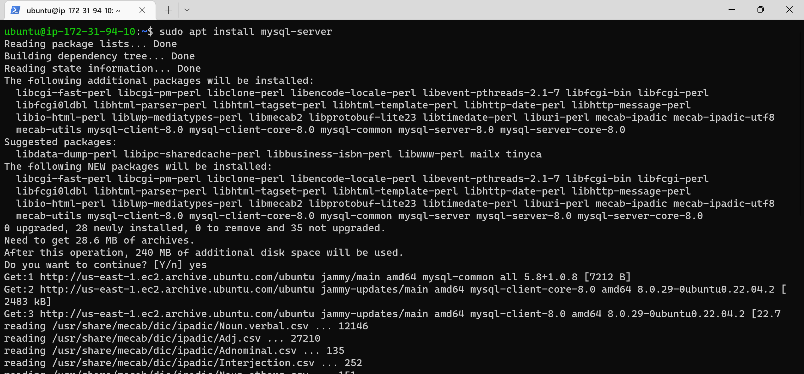

**STEP ONE**

Login into your AWS account, Lunch Ec2 instance with your prefered settings. Click [here](https://github.com/oayanda/WEB-STACK-IMPLEMENTATION-LAMP-STACK-IN-AWS/blob/main/Project1.md) for more details.

1. SSH into the Linux terminal AWS EC2 to update the packages and install nginx webserver.

`sudo apt update`

`sudo apt install nginx`

2. Verify ngnix is successfully running.

`sudo systemctl status nginx`

3. To access the nginx web server locally and in the browser - make sure the default (port 80) is opened in your security group settings.

- Locally
`curl http://localhost`

- In the browser (use the public Ip address of the vm)
`curl http://44.203.157.197/`

**STEP TWO**

Installation of the database - MySql.

1. Install MySql

`sudo apt install mysql-server`

2. Login into MySql

`sudo mysql`

3. Currently, we are login as the Admin (sudo mysql). Set a new password for the Admin/root by using mysql_native_password as default authentication method and the exit.

`ALTER USER 'root'@'localhost' IDENTIFIED WITH mysql_native_password BY 'PassWord.1';`

4.  For security reasons, we need to remove all insecure default settings (e.g, password strength, test database e.t.c) by a pre-installed script.

`sudo mysql_secure_installation;`

5. Test MySql Admin/root login and exit.

`sudo mysql -p`
