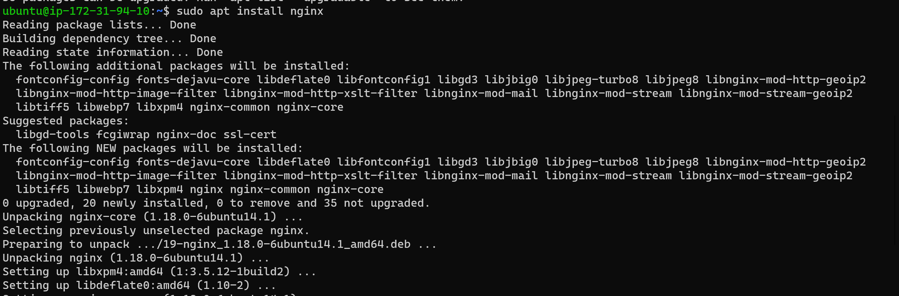
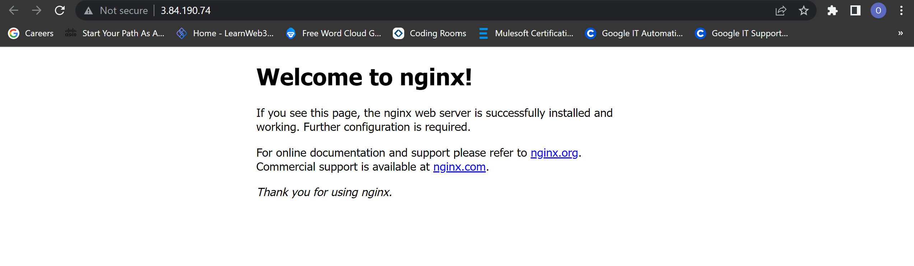

**STEP ONE**

Login into your AWS account, Lunch Ec2 instance with your prefered settings. Click [here](https://github.com/oayanda/WEB-STACK-IMPLEMENTATION-LAMP-STACK-IN-AWS/blob/main/Project1.md) for more details.

1. SSH into the Linux terminal AWS EC2 to update the packages and install nginx webserver.

`sudo apt update`

`sudo apt install nginx`

2. Verify ngnix is successfully running.

`sudo systemctl status nginx`

3. To access the nginx web server locally and in the browser - make sure the default (port 80) is opened in your security group settings.

- Locally
`curl http://localhost`

- In the browser (public Ip address of the vm)
`curl http://44.203.157.197/`

